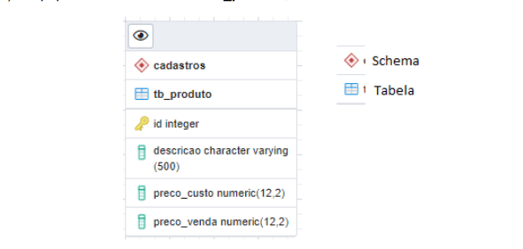
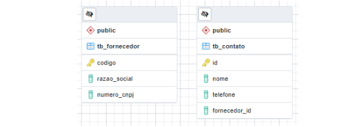
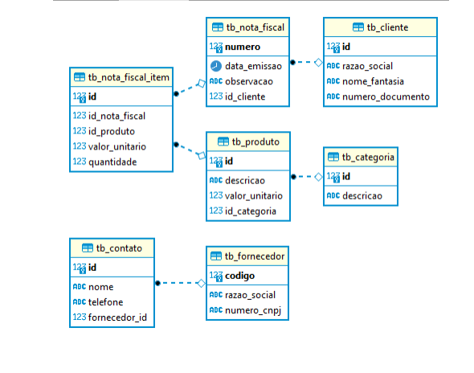

# Exercícios: Banco de Dados

1 - (Fácil) Defina qual é a estrutura (hierarquia) dos objetos dentro do SGDB PostgreSQL?

2 - (Fácil) Crie um Diagrama Lógico (utilizando [draw.io](http://draw.io)) e um Diagrama Físico (usando Excel) para representar o Desafio feito na Sprint anterior (Orientação a Objetos) caso esse utilizasse Banco de Dados.

3 - (Fácil) Dado o modelo de dados abaixo, crie: 
a) Script para criação da tabela **tb_produto**; 
b) Script para inclusão de um novo campo: categoria varchar(100) na tabela **tb_produto**; 
c) Script para exclusão da tabela **tb_produto**; 

4 - (Fácil) Dado o modelo de tabela tb_produto abaixo, crie: 
**a)** Script de inserção dos dados conforme imagem; 
**b)** Script de alteração do preço de custo do sofá para R$ 2249,00; 
**c)** Script de exclusão dos produtos com preço de venda menor que R$ 1000,00 

5 - (Fácil) O que é uma chave primária e quais são os seus principais benefícios?

6 - (Fácil) Usando como referência a tabela tb_cliente definida abaixo, desenvolver o script
SQL que crie a tabela definindo os campos código e numero_cnpj como chave primaria.
• codigo inteiro
• razao_social String (200)
• nome_fantasia String (200)
• numero_cnpj String (14)
• valor_capital_social decimal (12,2)

7 - (Médio) Dado o MER apresentado abaixo, desenvolva o script SQL que efetue a
criação de chave estrangeira, do tipo 1 para muitos, onde 1 fornecedor pode ter 1 ou mais
contatos.

8 - (Médio) Dado os registros das tabelas tb_fornecedor e tb_contato, desenvolva um
script SQL que apresente apenas o código, razão social e quantidade de contatos.
**Tabela tb_fornecedor**

**Tabela tb_contato**

9 - (Médio) Considerando as tabelas tb_fornecedor e tb_contato apresentadas no exercício
anterior, desenvolva o script SQL que apresente todos os fornecedores que não possuem
contatos cadastrados.

10 - (Médio) Construir os scripts SQL de criação da tabela, inclusão de 5 registros aleatórios,
exclusão do registro de codigo = 3 e exclusão da tabela, nesta ordem.

|  | Tabela: tb_dados_cadastro |  |
| --- | --- | --- |
| codigo | Inteiro  | Identity primary key |
| nome_completo | Varchar(50) |  |
| data_nascimento | Date |  |
| possui_filhos |  Varchar(1)  | S = SIM / N = NÃO |

11 - (Difícil) O que é normalização de dados e quais são as três principais formas normais?

12 - (Difícil) Dados o MER do sistema de vendas apresentado abaixo, desenvolva o script
SQL que apresente os produtos mais vendidos nos últimos 5 anos, ordenados por
quantidade de itens vendidos.

13 - (Difícil) Usando com base o diagrama do exercício anterior, desenvolver o script SQL
que apresente um relatório de vendas, somente dos produtos da categoria ‘escritorio’,
contendo as seguintes informações: Número da Nota Fiscal, Data de Emissão, Razão
Social do Cliente, código do Produto, Descrição do Produto, Quantidade vendida, Valor
Unitário Vendido e Valor Total Vendido.

14 - (Difícil) Ainda considerando o MER apresentado no exercício 12, caso seja executado
o comando “delete from tb_nota_fiscal Where numero = 12” e existam
registros gravados na tabela tb_nota_fiscal_item com este número, o comando será
executado com sucesso? Por quê?

15 - (Difícil) Considerando o MER do sistema de vendas apresentado no exercício 12,
construir um script SQL que apresente o valor médico comprado por cada cliente,
considerando todas as vendas existentes no banco de dados. O relatório deve apresentar
as seguintes informações: ID do Cliente, Razão Social do Cliente, Nome Fantasia do
Cliente e Valor Médio.
